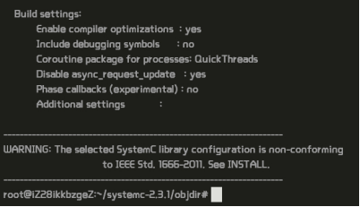
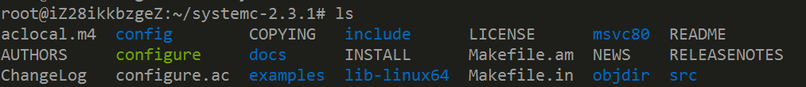
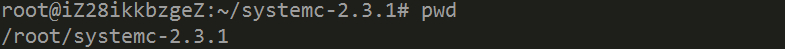

###DOL框架描述
分布式操作层（DOL）是一个使（半）自动应用程序映射到多处理器形状架构平台上的框架。由三个部分组成：
- 应用程序接口：The DOL defines a set of computation and communication routines that enable the programming of distributed, parallel applications for the SHAPES platform. Using these routines, application programmers can write programs without having detailed knowledge about the underlying architecture. In fact, these routines are subject to further refinement in the hardware dependent software (HdS) layer.
- 函数模拟：To provide programmers a possibility to test their applications, a functional simulation framework has been developed. Besides functional verification of applications, this framework is used to obtain performance parameters at the application level.
- 映射优化：The goal of the DOL mapping optimization is to compute a set of optimal mappings of an application onto the SHAPES architecture platform. In a first step, XML based specification formats have been defined that allow to describe the application and the architecture at an abstract level. Still, all the information necessary to obtain accurate performance estimates is contained.

Dol还有一些重要的程序包：
- dol.jar archive and compile scripts for the DOL functional simulation
- Third-party Java libraries used by DOL
- Example applications (source code and process network XML)
- Example architecture and mapping XML files
- Documentation of DOL API, DOL functional simulation, XML schema semantics, and examples

DOL还有一些重要接口文件：
The two links below lead to the API documentation of the DOL. Since the DOL is written in Java and the comments are written in Javadoc style, the Javadoc documentation contains more information. The Doxygen documentation, however, contains graphical class diagrams of the DOL, which are not provided by Javadoc.
- Javadoc Documentation
- Doxygen Documentation

###DOL安装过程
第一步：安装一些必要的环境。
                \$	sudo apt-get update
                \$	sudo apt-get install ant
				\$ 	sudo apt-get install openjdk-7-jdk
				\$	sudo apt-get install unzip

第二步：使用Vmware虚拟机下载文件。
                sudo wget http://www.accellera.org/images/downloads/standards/systemc/systemc-2.3.1.tgz

sudo wget http://www.tik.ee.ethz.ch/~shapes/downloads/dol_ethz.zip

第三步：解压文件。
 -  新建dol的文件夹      \$	mkdir dol
 - 将dolethz.zip解压到 dol文件夹中   \$	unzip dol_ethz.zip -d dol
 -  解压systemc        \$	tar -zxvf systemc-2.3.1.tgz
                 
第四步：编译systemc。
-  解压后进入systemc-2.3.1的目录下  \$	cd systemc-2.3.1
- 新建一个临时文件夹objdir    \$	mkdir objdir
- 进入该文件夹objdir    \$	cd objdir
-  运行configure(能根据系统的环境设置一下参数，用于编译)   
      \$	../configure CXX=g++ --disable-async-updates
                下图为运行configure之后的截图

- 编译   \$	sudo make install
-  编译完后文件目录如下(\$ cd ..        \$ ls）

- 记录当前的工作路径(会输出当前所在路径，记下来，待会有用)  \$	pwd

                这里表示我当前的工作路径为 /root/systemc-2.3.1
                
第五步：编译dol
- 进入刚刚dol的文件夹     \$	cd ../dol
- 修改build_zip.xml文件
找到下面这段话，就是说上面编译的systemc位置在哪里，
 property name="systemc.inc" value="YYY/include"/
 property name="systemc.lib" value="YYY/lib-linux/libsystemc.a"/
 把YYY改成上页pwd的结果（注意，对于  64位 系统的机器，lib-linux要改成             lib-linux64）
- 然后是编译      \$	ant -f build_zip.xml all
若成功会显示build successful

###实验感想和心得
- 我的dol安装过程很顺利，按着所给的实验步骤就很容易的建立成功了。
- 虽然我的安装过程很顺利，但是一些小的细节错误却非常容易导致失败，比如空格错误，打字错误，这些在自己安装的时候要非常小心，因为这些错误不太容易被找到。
- 使用markdown时，由于不同版本的markdown编辑器的语法稍有不同，所以我尝试了几个不同的编辑器，最终我觉得马克飞象还是比较好用的，它的图片导入非常方便，只需要拷贝过来就可以了，而且界面看起来比较舒服，整洁。

