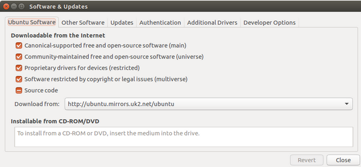
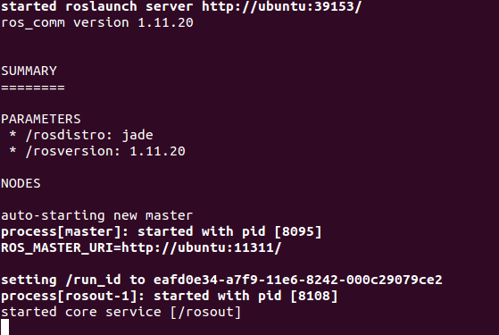
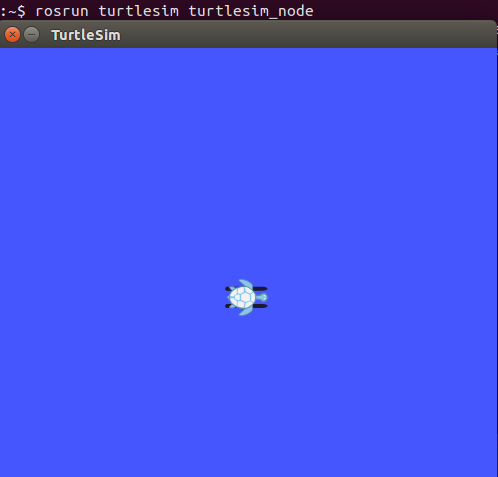
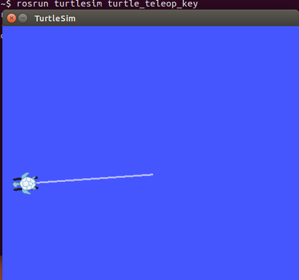

### 在Ubuntu中安装ROS Jade

1.  配置 Ubuntu 软件仓库
   配置 Ubuntu 软件仓库(repositories) 以允许 "restricted"、"universe" 和 "multiverse"这三种安装模式。只要在下图中所示的的关于"restricted"、"universe" 和 "multiverse"都打勾，其它保持默认设置就可以了。
          

2. 添加 sources.list
   配置电脑使其能够安装来自 packages.ros.org的软件包。
   执行语句：$ sudo sh -c 'echo "deb http://packages.ros.org/ros/ubuntu $(lsb_release -sc) main" > /etc/apt/sources.list.d/ros-latest.list'

3.  添加 keys
   执行语句：$ sudo apt-key adv --keyserver hkp://pool.sks-keyservers.net --recv-key 0xB01FA116

4.  安装
   ·将Debian软件包索引更新至最新：
   执行语句：$ sudo apt-get update
   ·安装ROS函数库和必要的工具
     桌面完整版安装：包含ROS、rqt、rviz、通用机器人函数库、2D/3D仿真器、导航以及2D/3D感知功能。
     执行语句：$ sudo apt-get install ros-jade-desktop-full
   ·查找可用软件包
     运行：$ apt-cache search ros-jade

5.  初始化 rosdep
在开始使用ROS之前你还需要初始化rosdep。rosdep可以方便在你需要编译某些源码的时候为其安装一些系统依赖，同时也是某些ROS核心功能组件所必需用到的工具。
执行语句：$ sudo rosdep init
执行语句：$ rosdep update

6.  环境配置
   令每次打开一个新的终端时ROS环境变量都能够自动配置好（即添加到bash会话中）
   如果你安装有多个ROS版本, ~/.bashrc 必须只能 source 你当前使用版本所对应的 setup.bash。
   执行语句：$ echo "source /opt/ros/jade/setup.bash" >> ~/.bashrc
   执行语句：$ source ~/.bashrc
   如果你只想改变当前终端下的环境变量，可以执行以下命令：
$ source /opt/ros/jade/setup.bash
7. 安装 rosinstall
    rosinstall 是ROS中一个独立分开的常用命令行工具，它可以方便让你通过一条命令   
    就可以给某个ROS软件包下载很多源码树。
     安装rosinstall，  执行语句： $ sudo apt-get install python-rosinstall
至此，在Ubuntu中安装ROS Jade就结束了
###检验安装是否成功
a、在Terminal中输入下诉命令。该命令是初始化ROS环境，全局参数，以及每个节点注册等工作。    
  执行语句：$ roscore
   执行后的截图如下：
             
       

b、再打开一个Terminal，输入命令。开启一个小乌龟界面。   
   执行语句：$ rosrun turtlesim turtlesim_node
   执行后的截图如下：
         

c、再打开一个Terminal，输入命令。接受键盘输入，控制小乌龟移动。 
   执行语句：$ rosrun turtlesim turtle_teleop_key
d、选中最后打开的Terminal，键盘按下上下左右按键，可看到控制小乌龟移动。如下图所示：

         \ 

实验问题解决与实验感想：
1. ROS的安装还是比较顺利的，按着流程一步一步来，进行完毕，就可以安装成功了。
2. 我开始使用的是美国的镜像源，后来又重新来了一遍流程，把镜像源改为了国内的阿里云，这样的确提高了安装下载速度。
