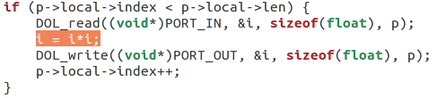
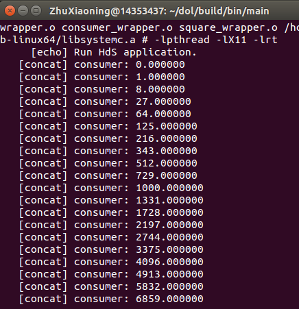
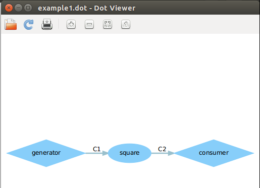
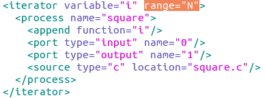
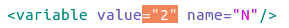
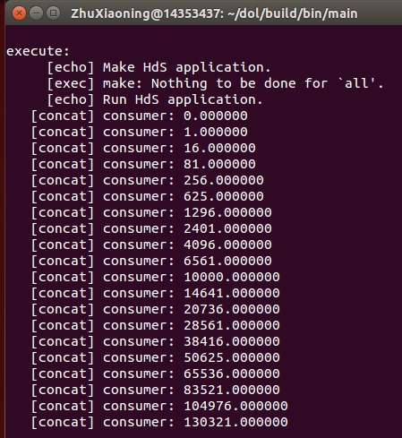

###example1和example2修改过程解析
#### 修改example1:
在example1中生产者与消费者通过square.c模块相连，square.c就是对输入的数字进行平方，如下图为square.c中重点代码部分：

所以我修改其中的平方为立方，如下图：

修改后运行程序结果如下：

.dot图如下：（由于我没修改文件名，所以文件名仍为square）

#### 修改example2:
在原example2中，设定平方的迭代次数为3，如下图：

所以我将3改成了2，就令square的迭代次数改为了两次：如下图：

修改后程序运行结果如下：

.dot图如下：

### 实验感想
- 一开始我修改完毕之后运行example1和example2发现example1不成功而example2成功，原因是因为我曾经在安装的时候运行过example1,所以example1的运行文件已经形成了，而我修改后没有重新编译，所以example1运行后一直是没有修改前的结果。所以对于这种情况我们可以删除build中的example1文件或是重新编译。
- 在修改代码之前，我觉得我们必须先认真理解代码，当你明白这份代码每个部分分别是实现什么的，那么你就找到解决方法比较快，而且可能找到的方法也比较优化，我这次就实现十分认真的理解了一下代码，所以我这次修改的很快并且成功了。

